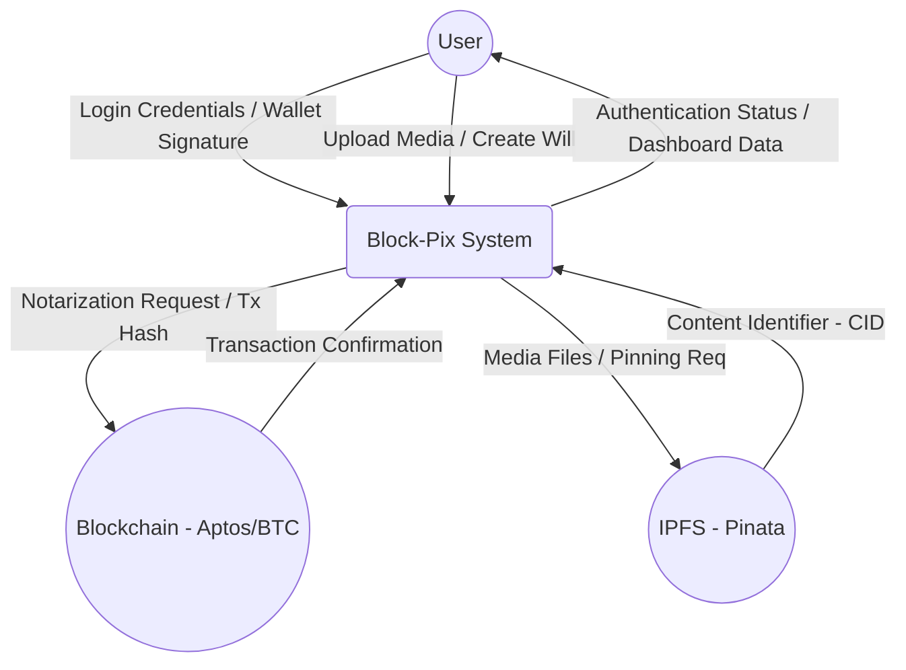
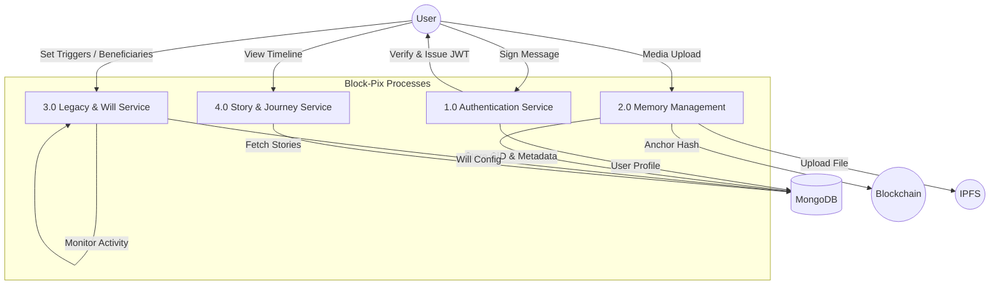
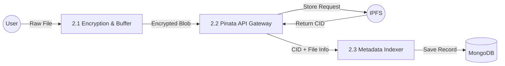
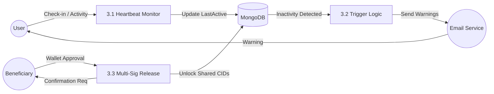

# Data Flow Diagrams (DFD) for Block-Pix

This document outlines the data flow of the **Block-Pix** ecosystem from the Context Level (0) to the Detailed Level (2).

---

## 1. Level 0: Context Diagram
The Context Diagram represents the entire system as a single process and its interactions with external entities.

---

## 2. Level 1: Process Diagram
Level 1 breaks the system into its primary functional modules.

---

## 3. Level 2: Detailed Data Flow
Detailed breakdown of the **Memory Storage** and **Digital Will** processes.

### 2.1 Memory Management (Detailed)

### 2.2 Digital Will & Dead Man's Switch (Detailed)

---

## 4. Entity-Process Data Summary

| Process | Data Input | Data Output | Source/Sink |
| :--- | :--- | :--- | :--- |
| **Auth** | Wallet Signature | JWT Session Token | User / Auth Service |
| **Storage** | Media File | IPFS CID | User / Pinata |
| **Will** | Inactivity Period | Execution Event | User / DB |
| **Notary** | Memory Hash | On-chain Tx Hash | App / Aptos |
